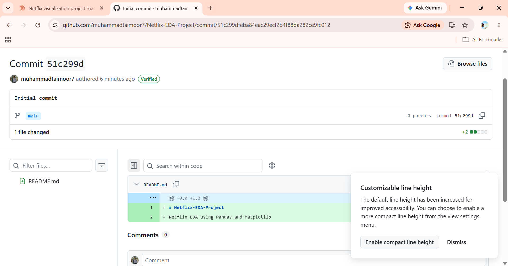

# 🏦 Loan Approval Prediction App

A machine learning web app that predicts whether a loan application is likely to be approved or rejected, built with **Streamlit** and a **Decision Tree** classifier.

🔗 **Live Demo:** [https://loan-prediction-apps-rdwrzbbmcvwcsnt5b6ryiy.streamlit.app](https://loan-prediction-apps-rdwrzbbmcvwcsnt5b6ryiy.streamlit.app)

## Overview

The user enters applicant details in a simple form, and the trained model returns an instant prediction along with the approval probability.

## App Preview



## Dataset and Performance

- **Dataset:** DATASET_NAME
- **Records:** NUMBER_OF_ROWS
- **Train and test split:** 80 percent and 20 percent
- **Accuracy:** XX percent

The model relies mainly on Credit History and Coapplicant Income, so applicants with a good credit history are far more likely to be predicted as approved.

## Input Features

| Feature | Description |
|---|---|
| Gender | Male or Female |
| Married | Yes or No |
| Dependents | 0, 1, 2, 3+ |
| Education | Graduate or Not Graduate |
| Self Employed | Yes or No |
| Applicant Income | Monthly income of the applicant |
| Coapplicant Income | Monthly income of the coapplicant |
| Loan Amount | Loan amount (in thousands) |
| Loan Amount Term | Loan duration in months |
| Credit History | Good (1) or Bad (0) |
| Property Area | Rural, Semiurban or Urban |

## Model

- **Algorithm:** Decision Tree Classifier (`max_depth=2`)
- **Target:** Loan status (`Y` = approved, `N` = rejected)
- **Most important features:** Credit History (about 93 percent) and Coapplicant Income (about 7 percent)

## Project Structure

```
├── app.py                # Streamlit application
├── final_model.pkl       # Trained Decision Tree model
├── label_encoder.pkl     # Label encoder for the target (Y, N)
├── columns.pkl           # Expected feature columns
├── requirements.txt      # Python dependencies
├── screenshot.png        # App preview image
└── README.md
```

## Run Locally

```bash
# 1. Clone the repository
git clone https://github.com/muhammadtaimoor7/loan-prediction-app.git
cd loan-prediction-app

# 2. Install dependencies
pip install -r requirements.txt

# 3. Start the app
python -m streamlit run app.py
```

The app opens at `http://localhost:8501`.

## Tech Stack

- Python
- Pandas
- Scikit-learn
- Joblib
- Streamlit

## Author

**Muhammad Taimoor**
GitHub: [@muhammadtaimoor7](https://github.com/muhammadtaimoor7)
